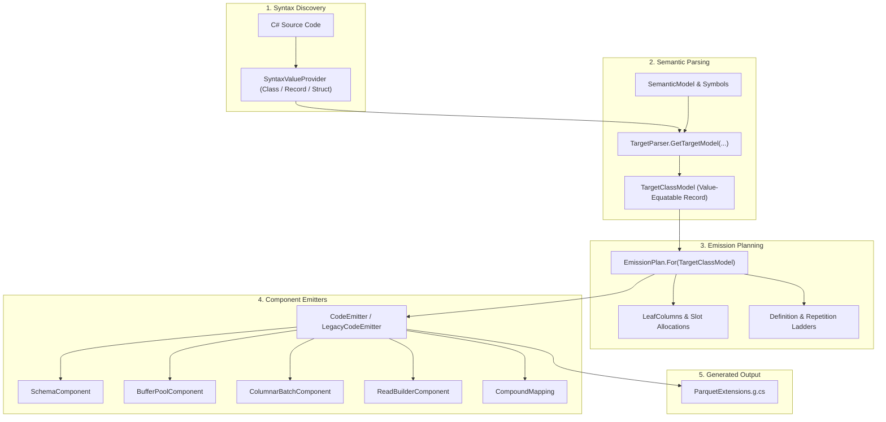

# System Architecture Overview

This document provides a technical walkthrough of the internal subsystem architecture, compilation pipeline, and emitter topology of `Parquet.SourceGenerator`.

For the high-level product motivation and design philosophy, see the [Vision & Design Tenets](../vision.md).

---

## 1. Subsystem Architecture & Compilation Pipeline

The source generator implements Roslyn's `IIncrementalGenerator` interface. The execution pipeline is divided into distinct, decoupled phases designed to maximize Roslyn incremental caching and minimize compilation churn:

### Stage 1: Syntax Discovery (`SyntaxValueProvider`)
- The pipeline begins with a lightweight syntax filter checking for type declarations annotated with `[ParquetSerializable]` (or the legacy attribute `[ParquetClass]`).
- No symbol resolution or type system binding occurs in this filter, keeping Roslyn syntax pass overhead negligible.

### Stage 2: Semantic Parsing (`TargetParser`)
- When an annotated type syntax node changes, `TargetParser` inspects the node using Roslyn's `SemanticModel`.
- It validates attributes, properties, nested hierarchy depth, and types, producing a clean `TargetClassModel`.
- **Value Equality Invariant**: Every model type (`TargetClassModel`, `PropertyModel`, etc.) is an immutable C# record implementing value equality. Roslyn uses `Equals` to skip downstream stages if code changes (such as method body edits) did not change the model shape.

### Stage 3: Emission Planning (`EmissionPlan`)
- Rather than recalculating column offsets, buffer slots, or repetition/definition level ladders dynamically across multiple emitters, an `EmissionPlan` is synthesized once per model.
- The plan resolves:
  - Column ordering and slot indices.
  - Primitive vs Compound (nested structs and lists) column leaf chains.
  - Definition level thresholds (`MaxDef`) and repetition level boundaries (`MaxRep`).
  - Rental size expressions and buffer requirements.

### Stage 4: Modular Code Emission (`CodeEmitter`)
- The emitter translates the `EmissionPlan` into idiomatic, zero-allocation C# source code.
- Emission is partitioned into focused, single-responsibility components:
  - **`SchemaComponent`**: Emits static `ParquetSchema` and `DataField` definitions.
  - **`BufferPoolComponent`**: Emits `ArrayPool.Shared` buffer rentals, slicing, and deterministic cleanup.
  - **`ColumnarBatchComponent`**: Emits vectorized column batch writes and row-to-column transposition.
  - **`ReadBuilderComponent`**: Emits the public fluent reader struct (`<Model>ParquetReader`) and terminal materializers (`ToArrayAsync`, `ToListAsync`, `AsBatchesAsync`).
  - **`CompoundMapping`**: Emits nested struct flattening and multi-level list level-shredding (Dremel definition/repetition ladders).

---

## 2. Generator Assembly Topology

The generator repository is structured into distinct projects separated by operational role and dependency constraints:

| Project | Target | Description | Dependencies |
|:---|:---|:---|:---|
| `Parquet.SourceGenerator.Attributes` | `netstandard2.0`, `net8.0` | Consumer-facing attributes (`[ParquetSerializable]`, `[ParquetColumn]`, etc.) | **Zero dependencies** |
| `Parquet.SourceGenerator` | `netstandard2.0` (Analyzer) | Modern Roslyn incremental generator targeting **Parquet.Net 6.x** | Roslyn 4.8 / 4.12 analyzers |
| `Parquet.SourceGenerator.Legacy` | `netstandard2.0` (Analyzer) | Legacy Roslyn incremental generator targeting **Parquet.Net 4.x** | Roslyn 4.8 / 4.12 analyzers |
| `Parquet.SourceGenerator.ApiGates` | `netstandard2.0` (Analyzer) | Build-time Roslyn analyzer enforcing public surface and internal seam contracts | Roslyn analyzers |

### Modern vs. Legacy Backends

- **Modern Generator (`Parquet.SourceGenerator`)**:
  - Targets `Parquet.Net 6.x` APIs (`ParquetRowGroupWriter.WriteColumnAsync`, `ParquetRowGroupReader.ReadColumnAsync`).
  - Emits packed definition-level ladders for compound structs and lists.
  - Generates unified batch reader/writer pipelines and fluent builder interfaces.
- **Legacy Generator (`Parquet.SourceGenerator.Legacy`)**:
  - Targets `Parquet.Net 4.x` APIs with flat-aligned arrays.
  - Maintains source compatibility for enterprise ecosystems pinned to older Parquet runtimes.
  - Shares core parser models and component infrastructure, but targets legacy row-group APIs.

---

## 3. Memory & Buffer Recycling Architecture

Minimizing garbage collection pressure in high-volume columnar data pipelines requires strict zero-allocation discipline:

1. **`ArrayPool<T>.Shared` Recycling**: Column buffers for primitive types are rented from the shared array pool prior to reading or writing a row group.
2. **Eager Buffer Return**: Once a column chunk is written via `WriteColumnAsync`, its buffer is immediately returned to `ArrayPool.Shared` rather than holding it open until row-group completion.
3. **Unboxed Memory Slices**: Strings and binary payloads utilize `ReadOnlyMemory<char>` and `ReadOnlyMemory<byte>` slices to prevent heap strings during column transposition.
4. **Borrowed Batches**: `<Model>Batch` exposes borrowed memory spans backed by rented buffers, giving consumers zero-allocation row access when processing streaming Parquet data.

Detailed memory triage, allocation bounds, and benchmarking protocols are documented in [Memory and Performance](memory-and-performance.md).

---

## 4. Visibility Boundaries & Governance

To prevent API sprawl and preserve internal agility, the system enforces three strict visibility tiers:

1. **Stable Public Contract**:
   - Includes user-facing attributes, `ParquetSerializerOptions`, and top-level entry points (`<Model>Parquet`).
   - Any additions or breaking changes require an approved entry in [`docs/api/LEDGER.md`](../api/LEDGER.md) and PR review diff verification.
2. **Internal Generated Capability**:
   - Low-level row-group readers/writers and schema resolvers are emitted as `internal static` methods in consumer assemblies.
   - Consumers cannot call or rely on these directly, permitting internal emitter optimization across releases without breaking consumer code.
3. **Repository Implementation Details**:
   - Internal generator types, AST nodes, and emitters are strictly internal to the generator assemblies.
   - Governed by build gate `PARQAPI002` which prevents widening members without registration in `src/api/seams.txt`.

For the full governance contract and catalogue signature grammar, see [API Governance](api-governance.md).
